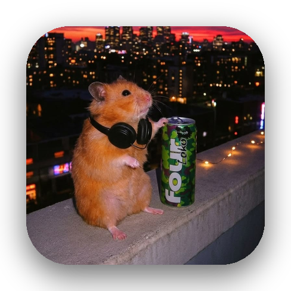

  

<b></b>

  

<h3>Asmit Biswas</h3>

📍 Naihati, West Bengal

<i>lowkey building cool stuff, highkey debugging it at 3 AM ☕ — turning bugs into ✨ features ✨ since day one 💀</i>

 

## 📌 About Me
- 👋 I'm **Rishi** — a CSE undergraduate at **Academy of Technology** who likes building real stuff, breaking it, fixing it, and learning in the process.
- 💻 Full Stack & Creative Tech enthusiast — into development, problem-solving, and shipping projects instead of just bookmarking tutorials.
- 🔐 Exploring **Cybersecurity & CTFs** — web security, forensics, OSINT, and the fun of figuring out how things break.
- 🎨 Design-minded too — into **UI/UX & Graphic Design**, because how it looks and feels matters as much as how it works.
- 📢 Experienced in PR, event coordination & team management.
- 🏋️ Gym + Code = lifestyle. I'd rather debug for 3 hours than watch a 10-minute tutorial.

## 🧠 My Focus Areas
- Full Stack Development
- Cybersecurity & CTF Challenges
- UI/UX + Creative Digital Experiences
- Data Structures & Problem Solving
- Hackathons & Tech Events
- Open Source Exploration

## 📊 GitHub Stats & Trophies

  
  

  

## 🛠️ Skills & Tech Stack

> ## Development & Tools

  &nbsp;&nbsp;&nbsp;&nbsp;&nbsp;&nbsp;&nbsp;&nbsp;&nbsp;&nbsp;&nbsp;&nbsp;&nbsp;&nbsp;&nbsp;&nbsp;&nbsp;&nbsp;&nbsp;&nbsp;&nbsp;&nbsp;&nbsp;&nbsp;&nbsp;&nbsp;&nbsp;

> ## Programming

  &nbsp;&nbsp;&nbsp;&nbsp;&nbsp;&nbsp;&nbsp;&nbsp;&nbsp;&nbsp;&nbsp;&nbsp;&nbsp;&nbsp;&nbsp;&nbsp;&nbsp;&nbsp;&nbsp;&nbsp;&nbsp;&nbsp;&nbsp;&nbsp;

> ## Cybersecurity & Linux

  &nbsp;&nbsp;&nbsp;&nbsp;&nbsp;&nbsp;&nbsp;&nbsp;&nbsp;&nbsp;&nbsp;&nbsp;

> ## Design & Creative

  &nbsp;&nbsp;&nbsp;&nbsp;&nbsp;&nbsp;&nbsp;&nbsp;&nbsp;&nbsp;

> ## PR & Management

  &nbsp;&nbsp;&nbsp;&nbsp;&nbsp;&nbsp;&nbsp;&nbsp;

> ## Core CS

  &nbsp;&nbsp;&nbsp;&nbsp;&nbsp;&nbsp;

  

 

  

 

## 🔗 Connect with Me

  &nbsp;&nbsp;&nbsp;&nbsp;&nbsp;&nbsp;&nbsp;&nbsp;

  

  

